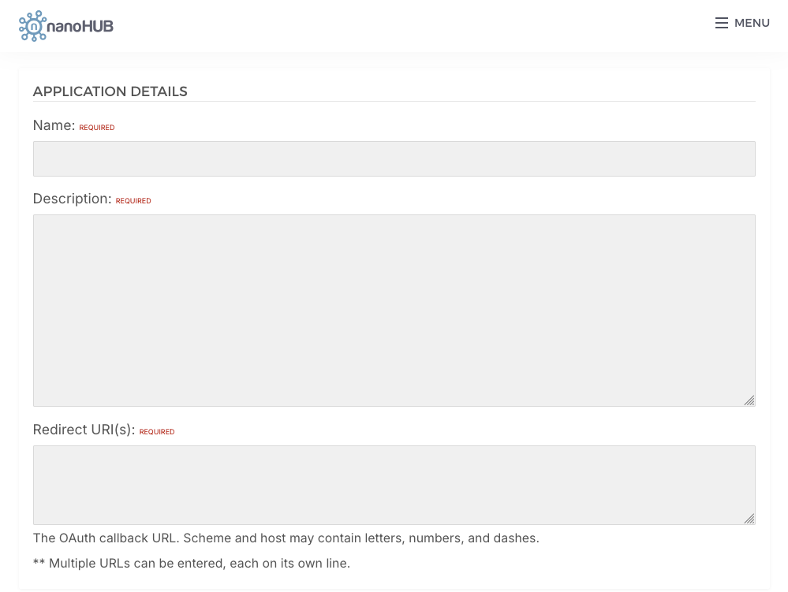

Web App Authentication
======================

This page shows two ways to authenticate users of a Flask web application
against nanoHUB using ``nanohub-remote``:

#. :ref:`auth-password-grant` — the app collects the user's username and
   password and exchanges them for an access token using your application's
   ``client_id`` / ``client_secret``.
#. :ref:`auth-redirect` — the app redirects the user to nanoHUB to sign in
   (the standard OAuth *Authorization Code* flow) and nanoHUB redirects the
   user back to your site once authenticated. The user never types their
   nanoHUB password into your app.

Both examples assume you have registered a web application and obtained a
``client_id`` and ``client_secret`` from:

https://nanohub.org/developer/api/applications/new

.. note::

   Never commit your ``client_secret`` to source control. Load credentials
   from environment variables (as shown below) or a secrets manager, and keep
   ``FLASK_SECRET_KEY`` random and private.

.. _auth-password-grant:

Option 1: Password Grant (client_id / client_secret)
----------------------------------------------------

In this flow your application renders its own login form, collects the
username and password, and exchanges them for an access token using the
OAuth *password* grant. The token is stored in the Flask session and reused
to rebuild a :class:`~nanohubremote.Project` (or :class:`~nanohubremote.Session`)
on each request.

This is the simplest option, but your application sees the user's nanoHUB
password directly, so only use it for trusted, first-party apps.

.. code-block:: python

   """
   nanoHUB web app — password grant authentication.

   Run:
       export FLASK_SECRET_KEY="$(python -c 'import secrets; print(secrets.token_hex())')"
       export NANOHUB_CLIENT_ID="your_client_id"
       export NANOHUB_CLIENT_SECRET="your_client_secret"
       python app.py
   """

   import os

   from flask import (
       Flask, render_template_string, request, redirect, url_for, session, flash
   )
   import nanohubremote as nr

   app = Flask(__name__)
   app.secret_key = os.environ["FLASK_SECRET_KEY"]

   CLIENT_ID = os.environ["NANOHUB_CLIENT_ID"]
   CLIENT_SECRET = os.environ["NANOHUB_CLIENT_SECRET"]
   CLIENT_URL = "https://nanohub.org/api/"

   def get_project():
       """Rebuild a Project session from the stored access token."""
       if "access_token" not in session:
           return None
       auth_data = {
           "grant_type": "personal_token",
           "token": session["access_token"],
       }
       return nr.Project(auth_data, url=CLIENT_URL)

   LOGIN_FORM = """
   <form method="post">
     <input name="username" placeholder="nanoHUB username" required>
     <input name="password" type="password" placeholder="password" required>
     <button type="submit">Sign in</button>
   </form>
   """

   @app.route("/", methods=["GET", "POST"])
   def login():
       if "access_token" in session:
           return redirect(url_for("home"))

       if request.method == "POST":
           auth_data = {
               "grant_type": "password",
               "client_id": CLIENT_ID,
               "client_secret": CLIENT_SECRET,
               "username": request.form["username"],
               "password": request.form["password"],
           }
           try:
               project = nr.Project(auth_data, url=CLIENT_URL)
               session["access_token"] = project.access_token
               project.close()
               return redirect(url_for("home"))
           except Exception as e:
               flash(f"Login failed: {e}")

       return render_template_string(LOGIN_FORM)

   @app.route("/home")
   def home():
       project = get_project()
       if project is None:
           return redirect(url_for("login"))
       try:
           projects = project.requestGet("projects/list").json().get("projects", [])
       finally:
           project.close()
       return f"
You have {len(projects)} project(s).
<a href='/logout'>Sign out</a>"

   @app.route("/logout")
   def logout():
       session.clear()
       return redirect(url_for("login"))

   if __name__ == "__main__":
       app.run(debug=True, port=5010)

.. _auth-redirect:

Option 2: Redirect to nanoHUB (Authorization Code flow)
-------------------------------------------------------

In this flow your application never sees the user's password. Instead it
redirects the browser to nanoHUB's authorization page. The user signs in on
nanoHUB and approves access, then nanoHUB redirects the browser back to your
application's ``redirect_uri`` with a short-lived ``code``. Your server
exchanges that ``code`` for an access token using the OAuth
*authorization_code* grant and stores the token in the Flask session.

Register your application first
~~~~~~~~~~~~~~~~~~~~~~~~~~~~~~~~~

Before you can use the redirect flow you must register a web application on
nanoHUB and tell it which callback URL(s) it is allowed to redirect back to.
Go to:

https://nanohub.org/developer/api/applications/new

and fill in the **Application Details** form:

* **Name** (required) — a name for your application.
* **Description** (required) — a short description of what your application
  does.
* **Redirect URI(s)** (required) — the OAuth callback URL. This **must**
  exactly match the ``redirect_uri`` your app sends (and the ``REDIRECT_URI``
  in the code below). The scheme and host may contain letters, numbers, and
  dashes. You can enter multiple URLs, each on its own line — for example one
  for local development and one for production:

  .. code-block:: text

     http://localhost:5010/callback
     https://myapp.example.com/callback

After you submit the form, nanoHUB issues a ``client_id`` and
``client_secret`` for your application. Use those in the example below.

OAuth endpoints used:

* **Authorize:** ``https://nanohub.org/developer/oauth/authorize``
* **Token:** ``developer/oauth/token`` (handled for you by ``nanohubremote``)

.. code-block:: python

   """
   nanoHUB web app — Authorization Code (redirect) authentication.

   The app sends the user to nanoHUB to sign in, then nanoHUB redirects
   back to /callback where the authorization code is exchanged for a token.

   Run:
       export FLASK_SECRET_KEY="$(python -c 'import secrets; print(secrets.token_hex())')"
       export NANOHUB_CLIENT_ID="your_client_id"
       export NANOHUB_CLIENT_SECRET="your_client_secret"
       python app.py
   """

   import os
   import secrets
   from urllib.parse import urlencode

   from flask import (
       Flask, request, redirect, url_for, session, abort
   )
   import nanohubremote as nr

   app = Flask(__name__)
   app.secret_key = os.environ["FLASK_SECRET_KEY"]

   CLIENT_ID = os.environ["NANOHUB_CLIENT_ID"]
   CLIENT_SECRET = os.environ["NANOHUB_CLIENT_SECRET"]
   CLIENT_URL = "https://nanohub.org/api/"

   # The nanoHUB page where the user signs in and approves access.
   AUTHORIZE_URL = "https://nanohub.org/developer/oauth/authorize"
   # Must match the Redirect URI registered for your application on nanoHUB.
   REDIRECT_URI = "http://localhost:5010/callback"

   def get_project():
       """Rebuild a Project session from the stored access token."""
       if "access_token" not in session:
           return None
       auth_data = {
           "grant_type": "personal_token",
           "token": session["access_token"],
       }
       return nr.Project(auth_data, url=CLIENT_URL)

   @app.route("/")
   def index():
       if "access_token" in session:
           return redirect(url_for("home"))
       return '<a href="/login">Sign in with nanoHUB</a>'

   @app.route("/login")
   def login():
       """Redirect the browser to nanoHUB to authenticate."""
       # A random state value protects against CSRF on the callback.
       state = secrets.token_urlsafe(16)
       session["oauth_state"] = state

       params = {
           "response_type": "code",
           "client_id": CLIENT_ID,
           "redirect_uri": REDIRECT_URI,
           "state": state,
           # "scope": "...",  # optional, if your app requests specific scopes
       }
       return redirect(AUTHORIZE_URL + "?" + urlencode(params))

   @app.route("/callback")
   def callback():
       """nanoHUB redirects the user back here with an authorization code."""
       # Verify the state to make sure this callback is the one we started.
       if request.args.get("state") != session.pop("oauth_state", None):
           abort(400, "Invalid OAuth state")

       if "error" in request.args:
           abort(400, f"Authorization failed: {request.args['error']}")

       code = request.args.get("code")
       if not code:
           abort(400, "Missing authorization code")

       # Exchange the code for an access token. nanohubremote performs the
       # POST to developer/oauth/token using these credentials.
       auth_data = {
           "grant_type": "authorization_code",
           "client_id": CLIENT_ID,
           "client_secret": CLIENT_SECRET,
           "code": code,
           "redirect_uri": REDIRECT_URI,
       }
       try:
           project = nr.Project(auth_data, url=CLIENT_URL)
           session["access_token"] = project.access_token
           project.close()
       except Exception as e:
           abort(400, f"Token exchange failed: {e}")

       return redirect(url_for("home"))

   @app.route("/home")
   def home():
       project = get_project()
       if project is None:
           return redirect(url_for("index"))
       try:
           projects = project.requestGet("projects/list").json().get("projects", [])
       finally:
           project.close()
       return f"
You have {len(projects)} project(s).
<a href='/logout'>Sign out</a>"

   @app.route("/logout")
   def logout():
       session.clear()
       return redirect(url_for("index"))

   if __name__ == "__main__":
       app.run(debug=True, port=5010)

How the redirect flow works
~~~~~~~~~~~~~~~~~~~~~~~~~~~~~

#. The user clicks **Sign in with nanoHUB** and hits ``/login``.
#. Your app redirects the browser to ``AUTHORIZE_URL`` with your
   ``client_id``, ``redirect_uri``, and a random ``state``.
#. The user signs in on nanoHUB and approves access.
#. nanoHUB redirects the browser back to ``REDIRECT_URI`` (``/callback``)
   with a ``code`` and the ``state`` you sent.
#. Your app verifies ``state``, then exchanges the ``code`` for an access
   token using the ``authorization_code`` grant.
#. The token is stored in the Flask session and reused on later requests.

Choosing between the two
------------------------

* Use the **password grant** for trusted, first-party tools (for example, an
  internal script or admin app) where typing the nanoHUB password directly
  into the app is acceptable.
* Use the **redirect / authorization code flow** for any app where users
  should authenticate on nanoHUB itself rather than handing their password to
  your application. This is the recommended approach for public-facing web
  apps.
