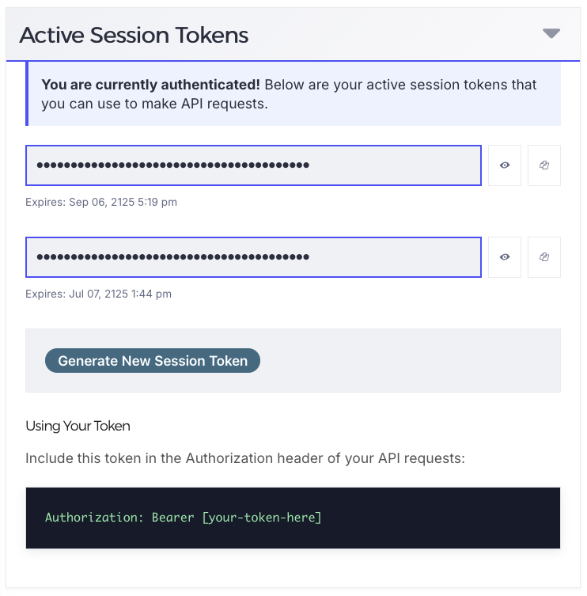

Quick Start
===========

This guide will help you get started with nanohub-remote.

Authentication
--------------

Personal Access Token (Recommended)
~~~~~~~~~~~~~~~~~~~~~~~~~~~~~~~~~~~~

.. code-block:: python

   import nanohubremote as nr

   auth_data = {
       'grant_type': 'personal_token',
       'token': 'your_personal_token'
   }

   session = nr.Session(auth_data)

To get a personal token, visit https://nanohub.org/developer/api/docs and
open the **Active Session Tokens** panel. Click the eye icon to reveal a
token or the copy icon to copy it, and use that value as ``token`` above.
Note the expiration date shown beneath each token.

OAuth Password Grant
~~~~~~~~~~~~~~~~~~~~

.. code-block:: python

   auth_data = {
       'client_id': 'your_client_id',
       'client_secret': 'your_client_secret',
       'grant_type': 'password',
       'username': 'your_username',
       'password': 'your_password'
   }

   session = nr.Session(auth_data)

To get client credentials, create a web application at:
https://nanohub.org/developer/api/applications/new

Basic Usage
-----------

Context Manager (Recommended)
~~~~~~~~~~~~~~~~~~~~~~~~~~~~~~

.. code-block:: python

   with nr.Session(auth_data) as session:
       response = session.requestGet('tools/list')
       tools = response.json()
       print(f"Found {len(tools['tools'])} tools")

Manual Session Management
~~~~~~~~~~~~~~~~~~~~~~~~~~

.. code-block:: python

   session = nr.Session(auth_data)
   try:
       response = session.requestGet('tools/list')
       tools = response.json()
   finally:
       session.close()

HTTP Methods
------------

GET Request
~~~~~~~~~~~

.. code-block:: python

   response = session.requestGet('tools/list')
   data = response.json()

POST Request
~~~~~~~~~~~~

Form data:

.. code-block:: python

   response = session.requestPost('endpoint', data={'key': 'value'})

JSON data:

.. code-block:: python

   response = session.requestPost('endpoint', json={'key': 'value'})

PUT Request
~~~~~~~~~~~

.. code-block:: python

   response = session.requestPut('resource/123', json={'status': 'updated'})

DELETE Request
~~~~~~~~~~~~~~

.. code-block:: python

   response = session.requestDelete('resource/123')

PATCH Request
~~~~~~~~~~~~~

.. code-block:: python

   response = session.requestPatch('resource/123', json={'field': 'value'})

Configuration
-------------

Custom Timeout
~~~~~~~~~~~~~~

.. code-block:: python

   session = nr.Session(auth_data, timeout=10)

Retry Configuration
~~~~~~~~~~~~~~~~~~~

.. code-block:: python

   session = nr.Session(auth_data, max_retries=5)

Connection Pooling
~~~~~~~~~~~~~~~~~~

.. code-block:: python

   session = nr.Session(
       auth_data,
       pool_connections=20,
       pool_maxsize=20
   )

All Options
~~~~~~~~~~~

.. code-block:: python

   session = nr.Session(
       auth_data,
       url="https://nanohub.org/api",  # Custom API URL
       timeout=10,                       # Request timeout (seconds)
       max_retries=5,                    # Max retries for failed requests
       pool_connections=20,              # Connection pool size
       pool_maxsize=20                   # Max pool size
   )

Error Handling
--------------

.. code-block:: python

   from requests.exceptions import RequestException

   try:
       with nr.Session(auth_data) as session:
           response = session.requestGet('invalid/endpoint')
           response.raise_for_status()
   except ConnectionError as e:
       print(f"Connection error: {e}")
   except RequestException as e:
       print(f"Request failed: {e}")

Next Steps
----------

* Check out :doc:`examples/index` for more detailed examples
* Read the :doc:`api/index` for complete API documentation
* See :doc:`testing` for information about running tests
